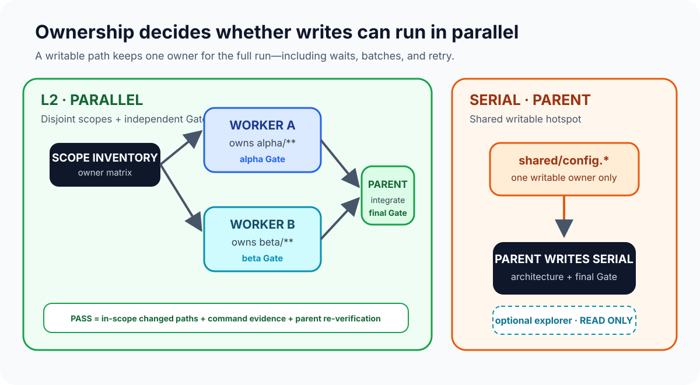
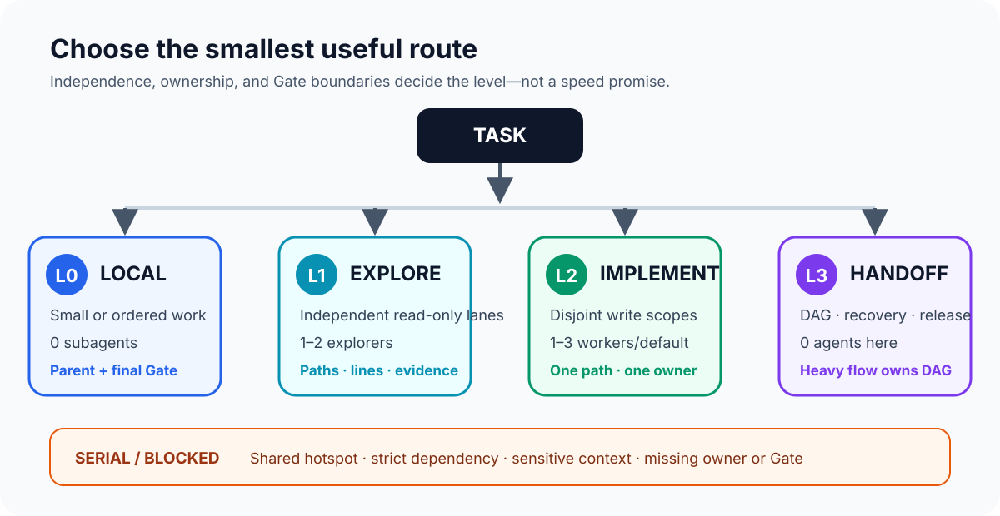
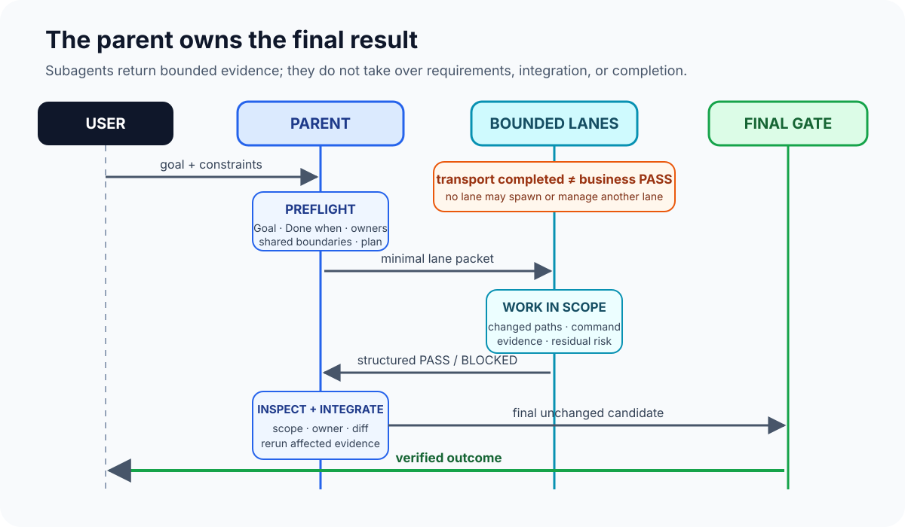
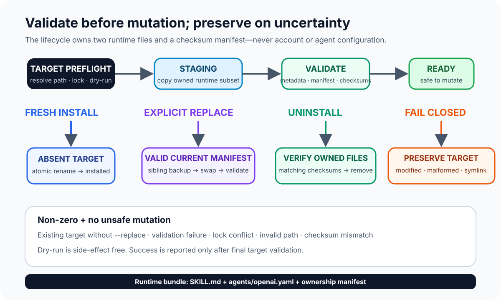
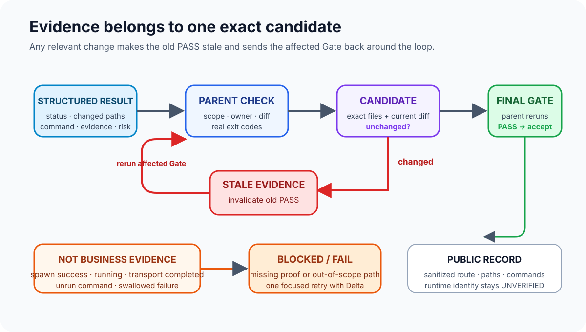

# Adaptive Subagent Orchestration

这个 skill 把中等规模的 Codex 任务路由到最小且有价值的车道集合，为每个可写路径固定一个全程 owner，并要求主线程用证据完成最终 Gate。本仓库是 skill、UI 元数据、生命周期脚本、测试和公开文档的 canonical source；它不是调度器，也不替代 Codex runtime。

**当前支持状态：** v0.2.0 是当前发布版本。它保持 balanced 为默认路由、保留显式 D1 compute offload，并把 `orchestrate-heavy-goals` 内置到同一仓库，使 L3 成为有版本契约和测试的执行路径。仓库测试覆盖静态契约、双 Skill 原子生命周期和前向夹具；跨全部 App／CLI 与操作系统的 D1／L3 请求级执行、隐式触发和 runtime identity 仍未验证，详见 [运行面矩阵](docs/runtime-surface-matrix.md)。


*图 1：一个父线程保持控制，两条隔离车道把证据返回到同一个结果。*

## 它解决什么

| 不使用这个 skill | 使用这个 skill |
| --- | --- |
| 临时决定是否委派。 | 先按 L0／D1／L1／L2／L3 标准选择路由和交接边界。 |
| 多个写入者边改边争 owner。 | 一个可写路径在整个运行中只有一个 owner。 |
| 把 transport 完成当成任务成功。 | 要求结构化结果、changed paths、验证命令、证据和 residual risk。 |
| 候选发生变化后继续沿用旧证据。 | 旧 PASS 失效，重新运行最终 Gate。 |
| 没有新诊断就重复重试。 | 原 owner 在原范围内最多进行一次带具体 Delta 的 focused retry。 |



*图 2：独立范围可以进入 L2，共享可写路径必须由父线程串行处理。*

一个边界清晰的实现可以进入显式启用的 D1；多个竞争车道必须有互不重叠的写入范围和独立 Gate，才能进入 L2。共享热点、严格依赖、无法剥离的敏感上下文、迁移或发布工作留在主线程串行处理。跨模块契约、波次、恢复或发布准备工作交给 L3 的 heavy orchestration。

## 路由级别



*图 3：只选择能够产生有价值独立车道的最小路由层级。*

| 级别 | 适用场景 | agent 数量 | 结果 |
| --- | --- | ---: | --- |
| **L0** | 单个小任务或有序任务没有有价值的独立车道。 | 0 | 主线程执行并运行最终 Gate。 |
| **D1** | 显式 `compute-offload` 模式下，单个非琐碎实现具备精确 owner、受限写入范围、可复跑 Gate 和正向委派价值。 | 1 个 `worker`，串行 | worker 实现，主线程检查并重跑最终 Gate；少于五分钟的任务仍是 L0。 |
| **L1** | 两个独立的只读调查能够明显降低不确定性。 | 1-2 个 `explorer` | 每条车道返回路径、行号、命令输出或明确阻塞。 |
| **L2** | 两个或更多实现车道拥有不相交范围和独立 Gate。 | 1-3 个 `worker`／`default` | 主线程集成、复核 owner 并运行最终 Gate。 |
| **L3** | 工作跨模块、需要冻结契约，或需要波次、恢复、发布准备。 | 父线程 A0 + 有界 domain／QA agents | 关闭 adaptive 车道，交接一个 `l3-v1` packet，再由内置 heavy 执行架构 → 契约 → DAG → 实现 → QA。 |

`balanced` 是默认模式，普通单车道任务仍走 L0。只有显式选择 `compute-offload`，预计至少 10 分钟或有明确上下文隔离收益的任务才可进入 D1。D1 的 discovery `explorer`、implementation `worker` 和可选只读 reviewer 均按顺序运行，不能同时执行。容量、owner、隐私和依赖检查仍可能把任务降为 `SERIAL` 或 `BLOCKED`。

## 显式调用

在 Codex 任务中直接调用：

```text
Use $adaptive-subagent-orchestration to assess this task, create only worthwhile independent lanes, and integrate verified results.
```

要卸载一个边界清晰的日常实现，显式指定模式：

```text
Use $adaptive-subagent-orchestration in compute-offload mode. Give one worker the exact owned scope and Gate, then inspect the result and rerun the final Gate in the parent.
```

直接启动 heavy goal，或承接 adaptive 的 L3 决策：

```text
Use $orchestrate-heavy-goals to establish the architecture, freeze contracts, build the wave DAG, execute bounded nodes, recover from drift, and produce verified release readiness. Stop at every manual Gate.
```

adaptive 与 heavy 共用同一个父线程 orchestrator。有效的 `l3-v1` 交接会先释放 adaptive owner，再启动 heavy A0；未知字段、active lane、无法最小化的敏感上下文、digest 不匹配、baseline drift 或 heavy capability 缺失都会 fail closed。详见 [L3 handoff 契约](docs/contracts/l3-handoff-contract.md)。



*图 4：Transport 完成不等于业务 PASS；父线程负责检查、集成和最终验证。*

UI 元数据只表示允许隐式触发，不保证 Codex 一定选择这个 skill。推荐显式调用。可以把可选规则手工复制到项目或用户的 `AGENTS.md`，安装脚本不会自动修改这些文件，模板见 [templates/AGENTS-routing.md](templates/AGENTS-routing.md)。

## 安全安装



*图 5：生命周期脚本只在校验通过后执行修改，存在不确定性时保留目标。*

运行包没有第三方 runtime 依赖，也不会配置或读取 account、provider、model、proxy、API key 或 token。skill discovery 和 subagent 能力由 Codex 提供；生命周期 registry 管理两个精确 runtime allowlist，并为每个已安装 Skill 写入一个 checksum manifest。

先预览推荐的完整套件安装：

```bash
./scripts/install.sh --target user --skills all --dry-run
```

把两个 Skill 安装到用户级或当前仓库：

```bash
./scripts/install.sh --target user --skills all
./scripts/install.sh --target repo --skills all
```

为了兼容 v0.1，`--skills` 默认仍是 `adaptive`；也可以使用 `--skills heavy` 单独安装 heavy。闭环配置推荐 `--skills all`。

自定义套件位置应传入绝对 skills root：

```bash
./scripts/install.sh --target-root /absolute/path/to/skills --skills all --dry-run
./scripts/install.sh --target-root /absolute/path/to/skills --skills all
```

旧的绝对 `--target /absolute/path/adaptive-subagent-orchestration` 仅支持 adaptive。默认用户 root 是 `$HOME/.agents/skills`；仓库 root 是当前工作目录下的 `.agents/skills`。已有目标不会被静默覆盖，检查全部目标后再使用 `--replace`：

```bash
./scripts/install.sh --target user --skills all --replace
```

替换前会校验所有选中 manifest 和精确 tree shape，在 staging 中准备全部 bundle，为旧目录生成 timestamped sibling backup，再原子激活并校验整个套件。失败会回滚所有选中目标；无法识别的私有目录永远不会被替换。manifest v2 记录精确文件及 `l3-source:l3-v1` 或 `l3-target:l3-v1` capability。

校验源目录或已安装目录：

```bash
./scripts/validate.sh .
./scripts/validate.sh "$HOME/.agents/skills/adaptive-subagent-orchestration"
./scripts/validate.sh "$HOME/.agents/skills/orchestrate-heavy-goals"
```

卸载支持 dry-run 并采用 fail-closed 行为。只有 manifest 拥有且 checksum 未变化的文件才会删除；owned 文件被修改、manifest 损坏、出现 symlink escape 或发生 lock 冲突时会拒绝删除并保留目标：

```bash
./scripts/uninstall.sh --target user --skills all --dry-run
./scripts/uninstall.sh --target user --skills all
```

完整套件卸载会先校验两个成员，再通过 rename 逻辑移除，最后清理 staging。partial suite、未知条目、checksum drift、symlink 或 lock 冲突都会保持“一个也不删”。

旧的私有安装不会自动迁移。只有明确想操作时才使用自定义绝对路径；不要把目标指向 source checkout。

## 案例

- [单 worker compute offload](docs/cases/single-worker-compute-offload.md)：展示 D1 准入、串行 discovery／review 和 fail-closed 边界。
- [独立写入车道](docs/cases/independent-write-lanes.md)：展示不相交 owner 和独立 Gate 的 L2 拆分。
- [共享热点串行](docs/cases/shared-hotspot-serial.md)：展示两个写入者触碰同一文件时为什么留在主线程。
- [L3 端到端 Flow](docs/cases/l3-end-to-end-flow.md)：展示 adaptive 检测、owner 释放、`l3-v1` packet、heavy 六阶段、分层 QA 和公开发布人工 Gate。

案例是契约示例，不是性能承诺。token 预算、冲突、任务耗时和 runtime 调度取决于宿主和具体任务。

## 支持边界与限制

- **Account／provider／model 中立：** 本仓库不读取、写入或推断这些配置；静态元数据不构成请求级 runtime identity。
- **隐式调用：** `allow_implicit_invocation` 只表示具备资格，Codex 仍可能不触发；可靠路径是显式调用 `$adaptive-subagent-orchestration`。
- **Runtime identity：** 除非脱敏的请求级记录直接证明，否则 exact provider、model、account 和 reasoning identity 都是 `UNVERIFIED`，不能从角色名或本地配置推断。
- **冲突和 token：** skill 可以识别共享 owner、记录 token 或上下文限制，但不能锁定文件、保证 token 可用，也不保证速度、成本或质量提升。
- **Runtime 边界：** subagent 的创建、等待和关闭由 Codex 完成；transport completed 不等于业务 `PASS`，主线程必须检查结构化结果，并在候选变化后重跑 Gate。
- **命令边界：** build、test 和 shell 命令仍在宿主工作区执行。D1 委派的是模型推理与工具控制，不会把本机 CPU 执行迁移到远端模型服务。
- **Heavy 边界：** 内置 heavy skill 提供工作流和本地 scaffold，不是持久调度器；A0 仍依赖 Codex task 状态和落盘 Flow artifact 完成恢复。
- **平台状态：** [运行面矩阵](docs/runtime-surface-matrix.md) 区分静态／前向证据与尚未验证的 App、CLI、OS 覆盖；Windows 仍不在当前支持声明内。



*图 6：证据只属于一个确定候选；相关变化会让之前的 PASS 失效。*

## 开发与验证

canonical source 在本仓库。adaptive 安装两个 runtime 文件；heavy 安装 Skill、metadata、七份 reference 和 scaffold script；每个目录另有一个 manifest。仓库测试和公开文档不会复制到运行目录。

```bash
python3 -m unittest discover -s tests -v
./scripts/validate.sh .
python3 -m compileall -q scripts tests
bash -n scripts/*.sh
git diff --check
```

贡献、漏洞报告和行为规范见 [CONTRIBUTING.md](CONTRIBUTING.md)、[SECURITY.md](SECURITY.md) 与 [CODE_OF_CONDUCT.md](CODE_OF_CONDUCT.md)。项目采用 Apache-2.0，并发布在 `https://github.com/hongkai-hue/adaptive-subagent-orchestration`。

集成后的路由、交接、heavy Flow 和原子生命周期见 [套件架构](docs/architecture/integrated-suite-architecture.md) 与 [交互式架构图](docs/architecture/integrated-suite-architecture.html) 。D1 仍由 [compute-offload 契约](docs/contracts/compute-offload-contract.md) 约束；L3 由 [handoff 契约](docs/contracts/l3-handoff-contract.md) 和 [suite lifecycle 契约](docs/contracts/suite-lifecycle-contract.md) 冻结。

最初的开源发布模型仍保留在 [v0.1 架构说明](docs/architecture/oss-launch-architecture.md) 与 [交互式发布图](docs/architecture/oss-launch-architecture.html) 中。

## 目录说明

- [`SKILL.md`](SKILL.md)：英文 runtime 路由契约。
- [`agents/openai.yaml`](agents/openai.yaml)：发现和调用元数据。
- [`skills/orchestrate-heavy-goals/`](skills/orchestrate-heavy-goals/)：自包含 heavy runtime canonical source。
- [`scripts/`](scripts/)：安装、校验和卸载入口。
- [`docs/contracts/l3-handoff-contract.md`](docs/contracts/l3-handoff-contract.md)：adaptive 到 heavy 的 owner 交接契约。
- [`docs/contracts/suite-lifecycle-contract.md`](docs/contracts/suite-lifecycle-contract.md)：manifest v2 和双 Skill 原子生命周期契约。
- [`docs/contracts/oss-launch-contract.md`](docs/contracts/oss-launch-contract.md)：v1 生命周期边界。
- [`docs/architecture/oss-launch-architecture.md`](docs/architecture/oss-launch-architecture.md)：模块 owner 和信任边界。
- [`docs/runtime-surface-matrix.md`](docs/runtime-surface-matrix.md)：当前证据和限制。
- [`tests/forward-test-record.md`](tests/forward-test-record.md)：脱敏前向证据记录。
