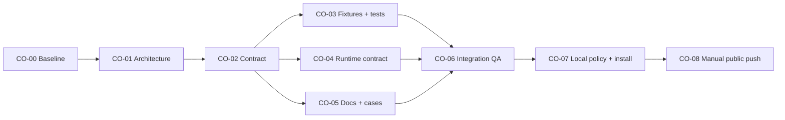

# Compute Offload DAG

## Objective

Add a provider-neutral, opt-in compute-offload mode that delegates one bounded implementation to
one worker, supports sequential explorer→worker discovery, preserves balanced behavior, and can be
enabled locally without changing the desktop parent account.

Non-goals: embedding private routes, changing CI configuration, publishing heavy orchestration,
tagging a release, or claiming request-level runtime identity or performance gains.

## Architecture And Contract Inputs

- Architecture: `docs/architecture/compute-offload-architecture.md` and `.html`
- Contract: `docs/contracts/compute-offload-contract.md` v1
- Baseline: `main@14a75c8`; source validation and 33/33 recursive tests PASS

## Flow

## Waves

| Wave | Nodes | Parallel rule |
| --- | --- | --- |
| W0 | CO-00 | Baseline only |
| W1 | CO-01 | Architecture and inspected diagram |
| W2 | CO-02 | Freeze routing and local-overlay contract |
| W3 | CO-03, CO-04, CO-05 | Logical separation; A0 writes serially in shared worktree |
| W4 | CO-06 | Integrated candidate and independent read-only QA |
| W5 | CO-07 | Local policy first, then fail-closed active runtime migration |
| W6 | CO-08 | Explicit public release Gate and online verification |

## Nodes

### CO-00 Baseline

- State: accepted
- Owner: A0
- Wave: W0
- Depends on: none
- Condition: always
- Inputs: clean repository and current project rules
- Exclusive write scope: none
- Outputs: baseline revision and Gate evidence
- Gate:
  - Criticality: required
  - Command: `./scripts/validate.sh . && python3 -m unittest discover -s tests -v`
  - Expected: exit 0 and 33 tests PASS
- Forbidden: repository mutation during baseline
- Failure owner: A0
- Retry: none

### CO-01 Architecture

- State: accepted
- Owner: A0
- Wave: W1
- Depends on: CO-00
- Condition: always
- Inputs: current runtime, host policy, lifecycle, and trust boundaries
- Exclusive write scope: `docs/architecture/compute-offload-architecture.*`
- Outputs: architecture Markdown and inspected HTML diagram
- Gate:
  - Criticality: required
  - Command: documentation structure test plus browser render
  - Expected: required modules/flows present and no visual overflow
- Forbidden: runtime changes before boundary review
- Failure owner: CO-01
- Retry: implementation rework <= 2

### CO-02 Contract

- State: accepted
- Owner: A0
- Wave: W2
- Depends on: CO-01
- Condition: architecture accepted
- Inputs: architecture and user-approved compute-offload design
- Exclusive write scope: `docs/contracts/compute-offload-contract.md`, Flow state
- Outputs: frozen v1 mode, D1, sequencing, safety, fixture, and migration contract
- Gate:
  - Criticality: required
  - Command: contract section and forbidden-route checks
  - Expected: all required sections and no private route assignment
- Forbidden: provider/model/account values
- Failure owner: CO-02
- Retry: contract review <= 2

### CO-03 Fixtures And Tests

- State: accepted
- Owner: A0
- Wave: W3
- Depends on: CO-02
- Condition: contract frozen
- Inputs: compute-offload contract v1
- Exclusive write scope: `tests/fixtures/forward-cases.json`, `tests/test_contract.py`, `tests/test_docs.py`
- Outputs: schema v2 fixtures and recursive coverage
- Gate:
  - Criticality: required
  - Command: `python3 -m unittest tests.test_contract tests.test_docs -v`
  - Expected: exit 0; D1 positive/negative/compatibility cases asserted
- Forbidden: weakened privacy or lifecycle checks
- Failure owner: CO-03
- Retry: implementation rework <= 2

### CO-04 Runtime Contract

- State: accepted
- Owner: A0
- Wave: W3
- Depends on: CO-02
- Condition: contract frozen
- Inputs: compute-offload contract v1
- Exclusive write scope: `SKILL.md`, `agents/openai.yaml`
- Outputs: provider-neutral balanced/compute-offload runtime instructions
- Gate:
  - Criticality: required
  - Command: `./scripts/validate.sh . && python3 -m unittest tests.test_contract -v`
  - Expected: exit 0 and runtime size/contract/privacy checks PASS
- Forbidden: private model, provider, endpoint, account, or credential configuration
- Failure owner: CO-04
- Retry: implementation rework <= 2

### CO-05 Documentation And Cases

- State: accepted
- Owner: A0
- Wave: W3
- Depends on: CO-02
- Condition: contract frozen
- Inputs: compute-offload contract v1
- Exclusive write scope: `README*.md`, `templates/**`, `docs/cases/**`, `CHANGELOG.md`
- Outputs: balanced/offload guidance, local overlay template, positive and fail-closed cases
- Gate:
  - Criticality: required
  - Command: `python3 -m unittest tests.test_docs -v`
  - Expected: exit 0; bilingual links and public neutrality checks PASS
- Forbidden: claims that code commands execute remotely or that a runtime identity is verified
- Failure owner: CO-05
- Retry: implementation rework <= 2

### CO-06 Integration And QA

- State: accepted
- Owner: A0/QA
- Wave: W4
- Depends on: CO-03, CO-04, CO-05
- Condition: integrated candidate unchanged
- Inputs: final canonical candidate
- Exclusive write scope: Flow state and `ROADMAP.md`
- Outputs: full Gate evidence and Release Readiness
- Gate:
  - Criticality: required
  - Command: source validation, recursive tests, compile, shell syntax, diff check, independent QA
  - Expected: all exit 0 and QA PASS
- Forbidden: QA agent modifying product files
- Failure owner: owning upstream node
- Retry: focused rework <= 2

### CO-07 Local Policy And Active Install

- State: accepted
- Owner: A0
- Wave: W5
- Depends on: CO-06
- Condition: canonical candidate accepted and user authorization already recorded
- Inputs: canonical runtime and local host rules
- Exclusive write scope: user-level `AGENTS.md` routing section and active skill runtime target
- Outputs: local compute-offload default, recoverable backup, installed manifest, runtime equality evidence
- Gate:
  - Criticality: required
  - Command: exact policy inspection, lifecycle validation, canonical/runtime byte comparison, static role-route audit
  - Expected: PASS without exposing or changing credentials
- Forbidden: authentication config, desktop parent route, private agent role values, or unrelated global rules
- Failure owner: CO-07
- Retry: one rollback and corrected migration

### CO-08 Manual Public Push

- State: waiting_for_manual_gate
- Owner: user/A0
- Wave: W6
- Depends on: CO-07
- Condition: explicit approval of the exact public mutation
- Inputs: accepted local Release Candidate
- Exclusive write scope: public repository `main`
- Outputs: normal push, CI, public README/docs verification
- Gate:
  - Criticality: required
  - Command: remote SHA, GitHub Actions, unauthenticated public URL checks
  - Expected: normal push, successful matrix, public content available
- Forbidden: force push, tag/Release changes, unrelated promotion
- Failure owner: CO-08
- Retry: normal follow-up only after diagnosis

## File Ownership

| Path / glob | Write owner | Readers | Notes |
| --- | --- | --- | --- |
| `SKILL.md`, `agents/openai.yaml` | A0 | QA | Runtime hotspot |
| `tests/**` | A0 | QA | Fixture schema and recursive assertions |
| `README*.md`, `templates/**`, `docs/cases/**` | A0 | QA | Bilingual public integration |
| `docs/architecture/compute-offload-*` | A0 | all | Flow architecture |
| `docs/contracts/compute-offload-contract.md` | A0 | all | Frozen after CO-02 |
| `docs/project/compute-offload-*`, `ROADMAP.md` | A0 | QA | Flow/release state |
| User-level policy and active skill target | A0 | QA | Modified only at CO-07 after canonical acceptance |
| Private agent TOML and authentication config | none | A0 read-only | Out of write scope |

## Manual Gates

CO-08 stops before public mutation and records the exact repository, branch, candidate, risk, and
rollback. Local policy/runtime synchronization is already authorized by the user's instruction to
implement the approved plan, but it must remain recoverable and must not touch credentials or the
desktop parent route.

## Conditions And Cancellation

- CO-07 is cancelled if the canonical candidate fails or local role routing no longer matches the
  required role boundary; public work may still remain a Release Candidate.
- CO-08 remains `waiting_for_manual_gate` until the user authorizes the exact push.
- Any runtime or fixture change invalidates CO-06 and all downstream evidence.
- A failed local migration restores the sibling backup before another attempt.
- The graph is acyclic; cancelled optional release work does not invalidate accepted local work.
