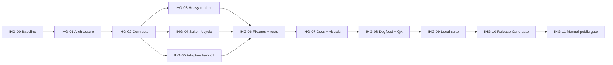

# Integrated Heavy Goals DAG

## Objective

Integrate a self-contained `orchestrate-heavy-goals` runtime into this repository, connect it to
adaptive L3 through a frozen handoff, and deliver a backward-compatible atomic suite lifecycle,
tests, public guidance, dogfooding evidence, and a local v0.2.0 Release Candidate.

Non-goals are provider/model routing, automatic host-policy edits, database changes, public push,
tag, or Release without a separate manual Gate.

## Architecture And Contract Inputs

- Architecture: `docs/architecture/integrated-suite-architecture.md` and `.html`
- Contracts: `docs/contracts/l3-handoff-contract.md`, `suite-lifecycle-contract.md`
- Baseline: `main@aa684f2`; source validation and 36 recursive tests PASS

## Flow

## Waves

| Wave | Nodes | Parallel rule |
| --- | --- | --- |
| W0 | IHG-00 | baseline only |
| W1 | IHG-01 | architecture and diagram |
| W2 | IHG-02 | freeze both cross-domain contracts |
| W3 | IHG-03, IHG-04, IHG-05 | logical independence; shared workspace permits one writer |
| W4 | IHG-06 | integrated schema and regression suite |
| W5 | IHG-07 | bilingual public integration |
| W6 | IHG-08 | dogfooding and layered QA |
| W7 | IHG-09 | isolated HOME install and explicit local migration |
| W8 | IHG-10 | local commit and fresh-clone Gate |
| W9 | IHG-11 | explicit public mutation and online checks |

## Nodes

### IHG-00 Baseline And Project Rules

- State: accepted
- Owner: A0
- Wave: W0
- Depends on: none
- Condition: always
- Exclusive write scope: `AGENTS.md`, Flow artifacts
- Outputs: baseline evidence and dual-runtime project rules
- Gate: required; current source validation, recursive tests, compile, shell syntax, diff check
- Forbidden: product runtime mutation before rules and baseline
- Failure owner: A0
- Retry: none

### IHG-01 Suite Architecture

- State: accepted
- Owner: A0
- Wave: W1
- Depends on: IHG-00
- Condition: always
- Exclusive write scope: `docs/architecture/integrated-suite-architecture.*`
- Outputs: module and trust boundaries plus interactive HTML
- Gate: required; architecture structure tests and desktop visual inspection
- Forbidden: lifecycle/runtime implementation
- Failure owner: IHG-01
- Retry: rework <= 2

### IHG-02 Frozen Contracts

- State: accepted
- Owner: A0
- Wave: W2
- Depends on: IHG-01
- Condition: architecture accepted
- Exclusive write scope: `docs/contracts/l3-handoff-contract.md`, `docs/contracts/suite-lifecycle-contract.md`
- Outputs: frozen `l3-v1` and lifecycle v2
- Gate: required; contract audit and schema tests
- Forbidden: private route assignments or ambiguous migration behavior
- Failure owner: IHG-02
- Retry: contract review <= 2

### IHG-03 Self-contained Heavy Runtime

- State: accepted
- Owner: A0
- Wave: W3
- Depends on: IHG-02
- Condition: contracts accepted
- Exclusive write scope: `skills/orchestrate-heavy-goals/**`
- Outputs: skill, metadata, bundled references, scaffold
- Gate: required; heavy contract, privacy, script tests
- Forbidden: mandatory unbundled skills or recursive delegation
- Failure owner: IHG-03
- Retry: implementation rework <= 2

### IHG-04 Suite Lifecycle

- State: accepted
- Owner: A0
- Wave: W3
- Depends on: IHG-02
- Condition: contracts accepted
- Exclusive write scope: `scripts/**`, lifecycle tests
- Outputs: selector-aware manifest v2 and atomic suite mutation
- Gate: required; lifecycle matrix and rollback injection
- Forbidden: target mutation before full preflight
- Failure owner: IHG-04
- Retry: implementation rework <= 2

### IHG-05 Adaptive Handoff

- State: accepted
- Owner: A0
- Wave: W3
- Depends on: IHG-02
- Condition: contracts accepted
- Exclusive write scope: root `SKILL.md`, root metadata
- Outputs: `l3-v1` packet and single-orchestrator transition
- Gate: required; handoff fixtures and runtime privacy
- Forbidden: D1 overriding L3 or heavy as a subagent
- Failure owner: IHG-05
- Retry: implementation rework <= 2

### IHG-06 Fixtures And Regression

- State: accepted
- Owner: A0
- Wave: W4
- Depends on: IHG-03, IHG-04, IHG-05
- Condition: all runtime domains integrated
- Exclusive write scope: `tests/**`
- Outputs: schema-v3 forward and L3 fixtures, heavy/scaffold/lifecycle tests
- Gate: required; recursive standard-library suite PASS
- Forbidden: weakening old L0-D2 or privacy assertions
- Failure owner: upstream domain
- Retry: focused rework <= 2

### IHG-07 Public Docs And Visuals

- State: accepted
- Owner: A0
- Wave: W5
- Depends on: IHG-06
- Condition: contracts and commands verified
- Exclusive write scope: `README*.md`, `docs/cases/**`, README assets, templates, changelog
- Outputs: bilingual suite guidance and closed-loop visual
- Gate: required; docs, links, accessibility, privacy, desktop/mobile visual checks
- Forbidden: unsupported runtime or identity claims
- Failure owner: IHG-07
- Retry: rework <= 2

### IHG-08 Dogfood And Layered QA

- State: accepted
- Owner: A0 / QA
- Wave: W6
- Depends on: IHG-07
- Condition: unchanged integrated candidate
- Exclusive write scope: Flow evidence, `ROADMAP.md`
- Outputs: real L3 case, accepted nodes, Release Readiness
- Gate: required; integration, recursive regression, fresh isolated lifecycle, visual QA
- Forbidden: QA changing product files while certifying the same candidate
- Failure owner: owning upstream node
- Retry: focused rework <= 2

### IHG-09 Local Suite Activation

- State: accepted
- Owner: A0
- Wave: W7
- Depends on: IHG-08
- Condition: canonical candidate accepted and user implementation authorization recorded
- Exclusive write scope: managed active skill targets only
- Outputs: recoverable backups, two v2 manifests, byte equality evidence
- Gate: required; installed validation and static discovery audit
- Forbidden: host account, provider, model, proxy, auth, or unrelated policy changes
- Failure owner: IHG-09
- Retry: one rollback and corrected migration

### IHG-10 Local Release Candidate

- State: accepted
- Owner: A0
- Wave: W8
- Depends on: IHG-09
- Condition: all local Gates accepted
- Exclusive write scope: final project evidence and local Git commit
- Outputs: clean v0.2.0 candidate and fresh-clone full Gate
- Gate: required; source validation, recursive tests, compile, shell syntax, diff, fresh clone
- Forbidden: public mutation
- Failure owner: owning upstream node
- Retry: focused rework <= 2

### IHG-11 Manual Public Gate

- State: accepted
- Owner: user / A0
- Wave: W9
- Depends on: IHG-10
- Condition: explicit authorization of exact repository, branch, candidate, tag, and Release scope
- Exclusive write scope: public repository `main`, optional tag and GitHub Release
- Outputs: normal push and online verification
- Gate: required; remote SHA, CI matrix, unauthenticated public content checks
- Forbidden: force push or unapproved tag/Release mutation
- Failure owner: IHG-11
- Retry: only after diagnosis and renewed scope if required

## File Ownership

| Path / glob | Write owner | Readers | Notes |
| --- | --- | --- | --- |
| `SKILL.md`, root metadata | IHG-05 | all | adaptive hotspot |
| `skills/orchestrate-heavy-goals/**` | IHG-03 | all | heavy runtime |
| `scripts/**` | IHG-04 | all | lifecycle hotspot |
| `tests/**` | IHG-06 | all | integrated regression |
| `README*.md`, cases, assets | IHG-07 | all | public guidance |
| suite architecture/contracts | A0 | all | frozen before implementation |
| Flow state and `ROADMAP.md` | A0 | QA | project truth |

## Manual Gates

IHG-11 requires a separate public mutation confirmation even after all local implementation Gates
pass. Any deletion, host configuration change, tag, or Release action remains separately scoped.

## Conditions And Cancellation

- Contract changes invalidate IHG-03 through IHG-10 as applicable.
- Runtime changes after QA invalidate IHG-08 through IHG-10.
- A failed local activation restores prior managed targets before retry.
- IHG-11 may remain waiting without invalidating the completed local Release Candidate.
- The DAG is acyclic; a cancelled optional publication does not cancel accepted implementation.
