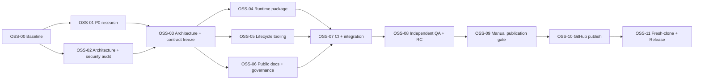

# Adaptive Subagent Orchestration OSS Launch DAG

## Objective

Publish a privacy-safe, portable, tested `v0.1.0` of
`adaptive-subagent-orchestration` under the user's authorized GitHub account, then
verify installation and uninstall from a fresh public clone.

Non-goals: configure providers/models/accounts, modify global Codex rules, support
untested platforms, or promote on external platforms without a separate authorization.

## Architecture And Contract Inputs

- Architecture: `docs/architecture/oss-launch-architecture.md`
- Diagram: `docs/architecture/oss-launch-architecture.html`
- Contract: `docs/contracts/oss-launch-contract.md` v1 frozen
- Baseline: `main@8c76b63`; 12 contract tests PASS; clean worktree before Flow scaffold

## Flow

## Waves

| Wave | Nodes | Parallel rule |
| --- | --- | --- |
| W0 | OSS-00 | Baseline only |
| W1 | OSS-01, OSS-02 | Read-only audits; no repository writes |
| W2 | OSS-03 | A0 freezes shared architecture and contract |
| W3 | OSS-04, OSS-05, OSS-06 | Parallel only with exclusive files; shared hotspots remain A0-owned |
| W4 | OSS-07 | Integration after all implementation nodes are accepted |
| W5 | OSS-08 | Independent QA; QA does not fix implementation |
| W6 | OSS-09 | Manual account/repository/license/history gate |
| W7 | OSS-10 | Sequential public repository creation and push |
| W8 | OSS-11 | Sequential fresh-clone verification and Release |

## Nodes

### OSS-00 Baseline

- State: accepted
- Owner: A0
- Wave: W0
- Depends on: none
- Condition: always
- Inputs: `main@8c76b63`
- Exclusive write scope: none
- Shared read scope: entire tracked repository
- Outputs: baseline revision, status, and test result
- Gate:
  - Criticality: required
  - Command: `python3 -m unittest discover -s tests -v && python3 -m compileall -q . && git diff --check`
  - Expected: exit 0; 12 tests PASS; initial worktree clean
- Forbidden: mutation before baseline evidence
- Failure owner: A0
- Retry: no implementation retry; investigate baseline drift

### OSS-01 P0 research

- State: accepted
- Owner: explorer `/root/oss_p0_recheck`
- Wave: W1
- Depends on: OSS-00
- Condition: always
- Inputs: public repository and current verified sources
- Exclusive write scope: none
- Shared read scope: repository and public web
- Outputs: current lane verdict and evidence-backed comparison
- Gate:
  - Criticality: required
  - Command: A0 verifies every material source URL and records the verdict
  - Expected: publish/differentiate/do-not-publish conclusion with current sources
- Forbidden: credentials, private configuration, repository writes
- Failure owner: A0/research agent
- Retry: one focused search retry

### OSS-02 Architecture and security audit

- State: accepted
- Owner: explorer `/root/oss_arch_security_audit`
- Wave: W1
- Depends on: OSS-00
- Condition: always
- Inputs: tracked repository and OSS plan
- Exclusive write scope: none
- Shared read scope: tracked files and non-secret Git metadata
- Outputs: module, trust-boundary, history/privacy, and Gate recommendations
- Gate:
  - Criticality: required
  - Command: A0 reconciles findings into architecture and contract
  - Expected: risks have an owning node and executable Gate
- Forbidden: `.env`, Codex config/agent TOML, Keychain, tokens, account data
- Failure owner: A0/audit agent
- Retry: one focused audit retry

### OSS-03 Architecture and contract freeze

- State: accepted
- Owner: A0
- Wave: W2
- Depends on: OSS-01, OSS-02
- Condition: always
- Inputs: audit results, official Codex docs, OSS plan
- Exclusive write scope:
  - `docs/architecture/**`
  - `docs/contracts/**`
  - `docs/project/oss-launch-*.md`
  - `docs/project/questions.md`
- Shared read scope: entire repository
- Outputs: architecture MD/HTML, frozen v1 contract, acyclic DAG
- Gate:
  - Criticality: required
  - Command: `python3 -m unittest tests.test_docs.ArchitectureDocsTests -v`
  - Expected: exit 0; HTML exists and required modules/flows are present
- Forbidden: implementation files, remote publication
- Failure owner: A0
- Retry: architecture review before downstream work

### OSS-04 Runtime package

- State: accepted
- Owner: worker A2
- Wave: W3
- Depends on: OSS-03
- Condition: always
- Inputs: frozen contract and existing forward fixtures
- Exclusive write scope:
  - `SKILL.md`
  - `agents/openai.yaml`
  - `tests/fixtures/forward-cases.json`
- Shared read scope: architecture, contract, existing tests
- Outputs: portable English runtime package with provider-neutral behavior
- Gate:
  - Criticality: required
  - Command: `python3 -m unittest tests.test_contract -v`
  - Expected: exit 0; contract invariants and privacy checks PASS
- Forbidden: scripts, README, CI, project status, local runtime copy
- Failure owner: OSS-04
- Retry: implementation rework <= 2

### OSS-05 Lifecycle tooling

- State: accepted
- Owner: worker A3
- Wave: W3
- Depends on: OSS-03
- Condition: always
- Inputs: frozen install manifest and path contract
- Exclusive write scope:
  - `scripts/**`
  - `tests/test_install.py`
- Shared read scope: runtime package and contract
- Outputs: install, validate, uninstall scripts and lifecycle tests
- Gate:
  - Criticality: required
  - Command: `python3 -m unittest tests.test_install -v`
  - Expected: exit 0; dry-run, install, conflict, replace, modified-file, uninstall cases PASS
- Forbidden: README, CI, global user directories, remote publication
- Failure owner: OSS-05
- Retry: implementation rework <= 2

### OSS-06 Public docs and governance

- State: accepted
- Owner: worker A4
- Wave: W3
- Depends on: OSS-03
- Condition: always
- Inputs: architecture, contract, current official sources
- Exclusive write scope:
  - `README.md`
  - `README.zh-CN.md`
  - `CONTRIBUTING.md`
  - `SECURITY.md`
  - `CODE_OF_CONDUCT.md`
  - `CHANGELOG.md`
  - `templates/**`
  - `docs/cases/**`
  - `docs/runtime-surface-matrix.md`
- Shared read scope: runtime package, scripts, tests
- Outputs: bilingual public guidance, governance, cases, optional AGENTS rule
- Gate:
  - Criticality: required
  - Command: `python3 -m unittest tests.test_docs.PublicDocsTests -v`
  - Expected: exit 0; install/limitations/citations/portable examples present
- Forbidden: license decision, CI, ROADMAP, private runtime evidence, promotion
- Failure owner: OSS-06
- Retry: implementation rework <= 2

### OSS-07 CI and integration

- State: accepted
- Owner: A0
- Wave: W4
- Depends on: OSS-04, OSS-05, OSS-06
- Condition: always
- Inputs: all accepted implementation artifacts
- Exclusive write scope:
  - `tests/test_contract.py`
  - `tests/test_docs.py`
  - `tests/evidence-template.md`
  - `tests/forward-test-record.md`
  - `.github/**`
  - `.gitignore`
  - `AGENTS.md`
  - `ROADMAP.md`
  - `LICENSE`
- Shared read scope: entire repository
- Outputs: recursive CI, privacy scan, sanitized evidence, license candidate, updated project state
- Gate:
  - Criticality: required
  - Command: `./scripts/validate.sh . && python3 -m unittest discover -s tests -v && git diff --check`
  - Expected: exit 0; every new test discovered; no sensitive/public blocker pattern
- Forbidden: GitHub mutation, tag, Release
- Failure owner: owning implementation node after isolation
- Retry: integration fixes <= 2 before contract review

### OSS-08 Independent QA and release candidate

- State: accepted
- Owner: QA explorer
- Wave: W5
- Depends on: OSS-07
- Condition: always
- Inputs: final local candidate and complete diff
- Exclusive write scope: none
- Shared read scope: entire candidate
- Outputs: scope audit, security-negative result, recursive regression, RC verdict
- Gate:
  - Criticality: required
  - Command: run full validation in a clean temporary HOME and checkout copy
  - Expected: exit 0; install, validate, modified-file protection, uninstall PASS
- Forbidden: implementation fixes, credentials, publication
- Failure owner: A0 routes each failure to OSS-04/05/06/07
- Retry: one independent recheck after fixes

### OSS-09 Manual publication gate

- State: not_started
- Owner: user/A0
- Wave: W6
- Depends on: OSS-08
- Condition: local RC ready
- Inputs: Release Readiness and exact proposed remote actions
- Exclusive write scope: none
- Outputs: account, repository, visibility, license, and history authorization
- Gate:
  - Criticality: required
  - Command: explicit user confirmation in the active task
  - Expected: exact account/repository/visibility/license/history decision
- Forbidden: inferring authorization from credentials alone
- Failure owner: A0
- Retry: wait for user decision

### OSS-10 GitHub publish

- State: not_started
- Owner: A0
- Wave: W7
- Depends on: OSS-09
- Condition: gate approved
- Inputs: accepted RC and authorized remote coordinates
- Exclusive write scope: Git metadata and authorized GitHub repository
- Outputs: public `main` branch and configured repository metadata
- Gate:
  - Criticality: required
  - Command: `gh repo view <owner>/adaptive-subagent-orchestration --json visibility,url,defaultBranchRef`
  - Expected: public visibility, expected URL, default branch `main`
- Forbidden: force-push, history rewrite, unrelated repository changes
- Failure owner: OSS-10
- Retry: one permissions/network retry, then block

### OSS-11 Fresh-clone verification and Release

- State: not_started
- Owner: A0 + QA
- Wave: W8
- Depends on: OSS-10
- Condition: public repository reachable
- Inputs: public repository URL
- Exclusive write scope: isolated temp clone and authorized GitHub Release
- Outputs: fresh-clone evidence, tag `v0.1.0`, Release, final online verification
- Gate:
  - Criticality: required
  - Command: fresh clone, full tests, temp-HOME install/validate/uninstall, `gh release view v0.1.0`
  - Expected: all exits 0; release and assets/notes reachable
- Forbidden: promotion or changes to other repositories
- Failure owner: owning node after isolation
- Retry: fix candidate, republish normal commit, rerun; no force-push

## File Ownership

| Path / glob | Write owner | Readers | Notes |
| --- | --- | --- | --- |
| `SKILL.md`, `agents/openai.yaml`, fixtures | OSS-04 | all | Runtime contract |
| `scripts/**`, `tests/test_install.py` | OSS-05 | all | Lifecycle implementation |
| Public README/governance/cases/templates | OSS-06 | all | User-facing docs |
| Architecture, contract, Flow artifacts | A0/OSS-03 | all | Shared design and state |
| Contract/docs tests, CI, license, ROADMAP | A0/OSS-07 | all | Integration hotspots |
| Git metadata and GitHub remote | A0/OSS-10/11 | QA read | Manual gate required |

## Manual Gates

- Gate ① defaults are recorded in `questions.md`; local work may continue, but a
  contradictory user answer invalidates affected downstream artifacts.
- Gate ② (OSS-09) blocks all remote mutations until the exact GitHub account,
  repository, visibility, license, and history policy are confirmed.
- Gate ③ promotion is outside this Flow and requires a separate request.

## Conditions And Cancellation

- If P0 concludes that a dominant equivalent project already owns the lane, stop after
  OSS-03 and ask whether to contribute upstream instead.
- If architecture or contract changes, cancel active W3 nodes and mark every accepted
  downstream node `needs_rework`.
- If one W3 node fails, unaffected siblings remain valid; OSS-07 waits for all required
  W3 nodes.
- If the manual publication gate is denied, OSS-10 and OSS-11 become `cancelled`; the
  local Release Candidate remains valid but the goal is not online.
- Any integration change after OSS-08 invalidates the QA evidence and returns OSS-08 to
  `needs_rework`.
- A failed public fresh-clone Gate returns the owning node to `needs_rework`; history is
  repaired with a normal commit, never an unapproved rewrite.
