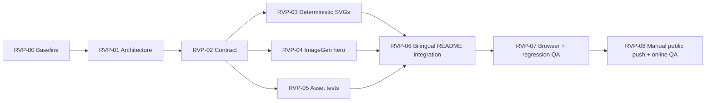

# README Visual Polish DAG

## Objective

Add a six-image visual narrative to both public READMEs without changing runtime behavior or
the installed bundle. Completion requires asset/README tests, browser visual QA, recursive
regression, the public push Gate, GitHub Actions, and public URL verification.

Non-goals: runtime changes, deterministic-trigger claims, new CI dependencies, animation,
tag/Release changes, and promotion outside the repository update.

## Architecture And Contract Inputs

- Architecture: `docs/architecture/readme-visual-polish-architecture.md` and `.html`
- Frozen contract: `docs/contracts/readme-visual-polish-contract.md` v1
- Approved plan: `adaptive-subagent-orchestration-readme-visual-polish-plan.md`
- Baseline: `main@fad59ae`; source validation and 29/29 recursive tests PASS

## Flow

## Waves

| Wave | Nodes | Parallel rule |
| --- | --- | --- |
| W0 | RVP-00 | Baseline only |
| W1 | RVP-01 | Architecture only |
| W2 | RVP-02 | Contract freeze |
| W3 | RVP-03, RVP-04, RVP-05 | Logical domains; A0 writes serially in the shared worktree |
| W4 | RVP-06 | Shared bilingual integration after assets/tests exist |
| W5 | RVP-07 | Browser, security, recursive regression, Release Candidate |
| W6 | RVP-08 | Manual public push and online verification |

## Nodes

### RVP-00 Baseline

- State: accepted
- Owner: A0
- Wave: W0
- Depends on: none
- Condition: always
- Exclusive write scope: none
- Outputs: baseline revision and test evidence
- Gate: required; `./scripts/validate.sh . && python3 -m unittest discover -s tests -v`; exit 0 and 29 tests PASS
- Forbidden: repository mutation during baseline
- Failure owner: A0
- Retry: none

### RVP-01 Architecture

- State: accepted
- Owner: A0
- Wave: W1
- Depends on: RVP-00
- Condition: always
- Exclusive write scope: `docs/architecture/readme-visual-polish-architecture.*`
- Outputs: architecture Markdown and inspected HTML diagram
- Gate: required; browser render at 1440×1200 plus architecture section/static checks
- Forbidden: runtime changes or edits to the existing OSS architecture
- Failure owner: A0
- Retry: implementation rework <= 2

### RVP-02 Contract

- State: accepted
- Owner: A0
- Wave: W2
- Depends on: RVP-01
- Condition: always
- Exclusive write scope: `docs/contracts/readme-visual-polish-contract.md`, Flow state
- Outputs: frozen v1 visual asset and README contract
- Gate: required; all contract sections and exact six-asset manifest present
- Forbidden: runtime/lifecycle semantic changes
- Failure owner: A0
- Retry: contract review <= 2

### RVP-03 Deterministic SVGs

- State: accepted
- Owner: A0
- Wave: W3
- Depends on: RVP-02
- Condition: always
- Exclusive write scope: `docs/assets/readme/*.svg`
- Shared read scope: `SKILL.md`, `docs/contracts/**`, `docs/cases/**`
- Outputs: five accessible local SVGs
- Gate: required; XML/safety/size tests PASS and browser screenshots show readable labels
- Forbidden: scripts, remote resources, runtime changes, unverified claims
- Failure owner: RVP-03
- Retry: implementation rework <= 2

### RVP-04 ImageGen Hero

- State: accepted
- Owner: A0
- Wave: W3
- Depends on: RVP-02
- Condition: always
- Exclusive write scope: `docs/assets/readme/hero-orchestration.webp`
- Outputs: selected 1600×900 WebP below 300 KB and final prompt record
- Gate: required; dimensions/size check and A0 visual inspection for topology, text, brands, and privacy
- Forbidden: text, logos, people, robots, provider/model/account symbols
- Failure owner: RVP-04
- Retry: one targeted regeneration/edit

### RVP-05 Asset Tests

- State: accepted
- Owner: A0
- Wave: W3
- Depends on: RVP-02
- Condition: always
- Exclusive write scope: `tests/test_docs.py`
- Outputs: recursive standard-library coverage for assets and SVG safety
- Gate: required; focused docs tests PASS and recursive discovery count increases
- Forbidden: third-party/network dependencies or weakened privacy checks
- Failure owner: RVP-05
- Retry: implementation rework <= 2

### RVP-06 Bilingual README Integration

- State: accepted
- Owner: A0
- Wave: W4
- Depends on: RVP-03, RVP-04, RVP-05
- Condition: all six assets accepted
- Exclusive write scope: `README.md`, `README.zh-CN.md`
- Outputs: same assets/order, localized alt/captions, architecture deep link
- Gate: required; bilingual manifest/caption/link/privacy tests PASS
- Forbidden: removal of essential prose or unsupported claims
- Failure owner: RVP-06
- Retry: implementation rework <= 2

### RVP-07 Browser + Regression QA

- State: accepted
- Owner: A0/QA
- Wave: W5
- Depends on: RVP-06
- Condition: integrated candidate unchanged
- Exclusive write scope: `docs/project/readme-visual-polish-*`, `ROADMAP.md`
- Outputs: desktop/mobile light/dark screenshots, full Gate evidence, Release Readiness
- Gate: required; browser assets render without overflow; full project commands exit 0
- Forbidden: fix product files inside independent QA or claim unrun coverage
- Failure owner: owning upstream node
- Retry: focused rework <= 2

### RVP-08 Manual Public Push + Online QA

- State: accepted
- Owner: user/A0
- Wave: W6
- Depends on: RVP-07
- Condition: explicit authorization of the exact public push
- Exclusive write scope: public `hongkai-hue/adaptive-subagent-orchestration` `main`
- Outputs: pushed commit, successful GitHub Actions, public README/assets HTTP 200
- Gate: required; `gh run` success plus unauthenticated public URL checks
- Forbidden: force push, tag/Release change, promotion, history rewrite
- Failure owner: RVP-08
- Retry: normal follow-up only after diagnosis

## File Ownership

| Path / glob | Write owner | Readers | Notes |
| --- | --- | --- | --- |
| `docs/assets/readme/**` | A0 | all | Hero plus five SVGs |
| `tests/test_docs.py` | A0 | QA | Shared test integration surface |
| `README.md`, `README.zh-CN.md` | A0 | QA | Shared bilingual integration surface |
| `docs/architecture/readme-visual-polish-*` | A0 | all | Flow architecture |
| `docs/contracts/readme-visual-polish-contract.md` | A0 | all | Frozen after RVP-02 |
| `docs/project/readme-visual-polish-*`, `ROADMAP.md` | A0 | QA | Flow/release state |
| `SKILL.md`, `agents/**`, `scripts/**` | none | all | Read-only and out of scope |

## Manual Gates

RVP-08 stopped before `git push` and recorded the repository/branch, diff, local QA, risk, and
rollback path. Explicit confirmation released only a normal push to
`hongkai-hue/adaptive-subagent-orchestration` `main`; no force push, tag/Release change, or
external promotion occurred.

## Conditions And Cancellation

- RVP-06 is cancelled if an asset node is removed; otherwise it waits for all dependencies.
- RVP-08 stayed `waiting_for_manual_gate` until explicit authorization, then required successful
  CI and unauthenticated public verification before acceptance.
- Any upstream artifact change invalidates browser/regression evidence and moves RVP-07 and
  RVP-08 back to `needs_rework`/`waiting_for_manual_gate`.
- The graph is acyclic; false conditions cancel only their dependent branch.
