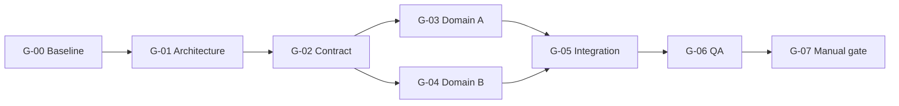

# Flow Artifact Templates

## Layout

```text
docs/
├── architecture/
│   ├── <flow>-architecture.md
│   └── <flow>-architecture.html
├── contracts/
│   └── <flow>-contract.md
└── project/
    ├── <flow>-dag.md
    ├── <flow>-status.md
    ├── questions.md
    └── <flow>-release-readiness.md
```

Use an existing equivalent project layout when present. Never move unrelated project artifacts.

## DAG

```markdown
# <Flow title> DAG

## Objective
<observable goal and explicit non-goals>

## Architecture And Contract Inputs
- Architecture: ...
- Contract: ...
- Baseline: ...

## Flow


## Waves
| Wave | Nodes | Parallel rule |
| --- | --- | --- |

## Nodes
<node cards from node-contract.md>

## File Ownership
<owner matrix>

## Manual Gates
<action, risk, rollback, and dependent branches>

## Conditions And Cancellation
<conditions, false behavior, invalidation, cancellation>
```

The DAG lists conditional edges, is acyclic, and states how optional nodes affect downstream work.

## Status

```markdown
# <Flow title> Status

Last verified: <ISO timestamp or date>

| Node | State | Owner | Evidence | Attempts | Lease / agent | Blocker / next action |
| --- | --- | --- | --- | ---: | --- | --- |

## State Rules
`not_started / in_progress / blocked / ready_for_review / accepted / needs_rework / waiting_for_manual_gate / cancelled`

## Active Worker Registry
| Agent ID | Node | Base revision | Scope | Started | Lease expires | State |
| --- | --- | --- | --- | --- | --- | --- |

## Latest Recovery Check
- Worktree inspected: yes/no
- Accepted Gates rerun: ...
- Drift found: ...
```

## Questions

```markdown
# Questions

| ID | Status | Class | Node | Affected branch | Question | Default decision | Adopted at | Answer | Impact |
| --- | --- | --- | --- | --- | --- | --- | --- | --- | --- |
```

Status is `open`, `answered`, or `superseded`. Class is `blocking` or `non_blocking`. Every
non-blocking question has an executable default and confined correction cost. A changed answer
invalidates affected artifacts and consumers.

## Contract

```markdown
# <Flow title> Contract

- Version: v1
- Status: draft | frozen | superseded
- Owners: A0, A1

## Scope And Non-goals
## Inputs And Outputs
## Data Schema
## State Transitions
## Errors And Failure Ownership
## Authentication And Authorization
## Idempotency And Concurrency
## Compatibility And Migration
## Examples
## Contract Gate
```

## Release Readiness

```markdown
# <Flow title> Release Readiness

## Decision
## Delivered Scope
## Node Evidence
| Node | Gate | Actual result | Evidence |
| --- | --- | --- | --- |
## Integration And Security Evidence
## Browser / Visual Evidence
## Persistence And Restart Evidence
## Open Questions And Defaults
## Residual Risks
## Rollback Or Disable Path
## Manual Release Steps
## Final Gate
```

Every completion statement traces to an accepted node and reproducible Gate.
